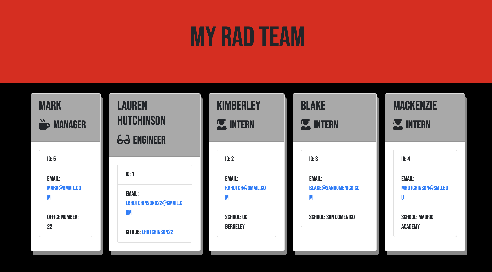

<h1> Object Oriented Programming </h1>

<h2>Project Details</h2>

This command line application builds a software engineering team by using inquirer prompts to collect user data about the different teammates information, and then generates a formatted/styled HTML file roster based on what the user inputted into the command line. This application passes all unit tests through using jest and inquirer. Class constructors can be generated or updated based on the user input in order to generate a new HTML page. 

To start the application, simply open the terminal and run: "node app.js"

<h2>Images</h2>

<h2>Questions</h2>

Github username: lhutchinson22

For a look at my repositories click this link: https://github.com/lhutchinson22

You can reach me at my email address: lbhutchinson022@gmail.com, if you have any questions at all!

For a walk-through video visit: https://drive.google.com/file/d/1E-zQoR0P-fDTNzRy_z3_bm7ojS2BMZrf/view

